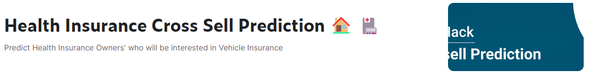

<h1 align="center">Health Insurance Cross-selling Prediction</h1>

Table of Content
=================

 <a href="#about">About</a> •
 <a href="#the-problem">The Problem</a> •
 <a href="#data-description">Data Description</a> •
 <a href="#goals">Goals</a> •
 <a href="#assumptions">Assumptions</a> •
 <a href="#tools">Tools</a> • 
 <a href="#execution">Execution</a> • 
 <a href="#solution">Solution</a> • 
 <a href="#how-to-use">How to use</a> • 
 <a href="#lessons-learned">Lessons Learned</a> • 
 <a href="#next-steps">Next Steps</a> • 
 <a href="#references">References</a> • 
 <a href="#autor">Autor</a> • 
 <a href="#team">Team</a>  • 
 <a href="#license">License</a> • 

# About 

Empresa de seguros de saúde e quer oferecer um novo produto: seguro de automóveis.

# The Problem

Identificar os clientes mais propensos a adquirir um seguro de automóveis (priorizar de maior para o menor).

# Data Description

| **Feature**          | **Definição** |
|----------------------|----------------|
| id                   | ID único do cliente|
| gender               |Sexo do cliente|
| age                  |Idade do cliente|
| region_code          |   Código único da região de cada cliente|
| policy_sales_channel |Código anônimo para o canal de divulgação para o cliente, ou seja. Different Agents, Over Mail, Over Phone, In Person, etc|
| driving_license      |0 : cliente não possui, 1 : cliente possui|
| vehicle_age          |idade do veículo|
| vehicle_damage       |Yes : O cliente teve seu veículo danificado no passado. No: O cliente não teve seu veículo danificado no passado.|
| previously_insured   |1 : Cliente já possui Seguro Automóvel, 0 : Cliente não possui Seguro Automóvel|
| annual_premium       |The amount customer needs to pay as premium in the year|
| vintage              |Número de dias em que o cliente está associado à empresa|
| response             |1 : O cliente está interessado no novo seguro, 0 : O cliente não está interessado no novo seguro|

# Goals

- Principais Insights sobre os atributos mais relevantes de clientes interessados em adquirir um seguro de automóvel.
- Qual a porcentagem de clientes interessados em adquirir um seguro de automóvel, o time de vendas conseguirá contatar fazendo 20.000 ligações?
- E se a capacidade do time de vendas aumentar para 40.000 ligações, qual a porcentagem de clientes interessados em adquirir um seguro de automóvel o time de vendas conseguirá contatar?
- Quantas ligações o time de vendas precisa fazer para contatar 80% dos clientes interessados em adquirir um seguro de automóvel?

# Planning

## Assumptions

- Registros com idade superiores a 18 anos
- 

## Tools

As seguintes ferramentas foram usadas na construção do projeto:

- [Python](https://www.python.org/)
- [Pandas](https://pandas.pydata.org/)
- [Jupyter Notebook](https://jupyter.org/)
- [Github](https://github.com/)
- [SKLearn](https://scikit-learn.org/stable/)
- [XGBoost](https://xgboost.readthedocs.io/en/stable/)

# Execution

 A solução do problema se dará com base no ciclo CRISP, em alguns passos que foram adaptados a metodologia. Aplicamos um modelo de Machine Learning de classificação:

- <b> Coletando dados </b>: coleta de dados de um dataset, disponibilizado pela organização do evento, na plataforma Kaggle.
- <b> Limpeza dos dados </b>: Verificação de tipos de dados e Nan's, renomear colunas, lidar com outliers.
- <b> Feature Engineering </b>: Criar novos recursos/features a partir dos originais, para que possam ser usados no modelo de ML.
-  <b> Exploratory Data Analysis (EDA) </b>: Em tal etapa, os dados foram explorados para obter experiência de negócios, buscar insights úteis e encontrar recursos importantes para o modelo de ML. 
- <b> Preparação de Dados </b>: Aplicação de Técnicas de Normalização e Reescalonamento nos dados; métodos de Encondagem e Transformação de Variáveis de Resposta.
- <b> Seleção de features </b>: Selecionando os melhores features para serem usadas no modelo de ML.
- <b> Machine Learning Modeling </b>: 
    - Rodar algoritmos: Naive Bayes (MixedNB), Random Forest (RandomForestClassifier), XGBoost (XGBClassifier).
    - Plotar curva de ganho cumulativo e lift, e calcular o F1 Score de cada modelo.
- <b> Hyperparameter Fine Tunning </b>: 
    - Fazer um ajuste fino de hiperparâmetros em cada modelo, identificando o melhor conjunto de parâmetros para maximizar suas capacidades de aprendizagem.
    -  Aplicar validação cruzada em cada modelo, reduzindo o viés de seleção (teoria da amostragem), por utilizar várias amostras diferentes dos dados.
    - Calcular F1 Score dos 3 modelos, e selecionar o de melhor performance.
    - Submeter esse modelo aos dados de teste, e plotar suas curvas de ganho cumulativo e lift.
- <b> Performance do modelo </b>: 
    - XGBoost - Média ponderada com F1 Score (dados validação): 0.86
    - XGBoost - Média ponderada com F1 Score (dados teste): 0.86
    - O modelo apresenta boa capacidade de generalização (classificar dados inéditos)

## Solution

- Criação de novas features
- A métrica utilizada foi a F1Score (média harmónica entre a precision(tentativas) e a recall(disponibilidade))

## How to use

+ Executar o comando em ambiente local: <em>git clone https://github.com/mbouhid/recommender_system.git</em>
+ Instalar as bibliotecas que estão no arquivo <em>requirements.txt</em>
+ Executar o arquivo <em>notebooks/model_health_insurance.ipynb</em>

## Lessons Learned

- Em projetos com curto espaço de tempo, importante estruturar e executar um modelo o mais rápido possível, pois o resultado servirá de baseline para os próximos.
- Planejar, definir e designar bem as atividades de cada participante.
- Focar em discussões para a criação de novas features.
- Conhecer sobre o negócio e entender as features do dataset original.

## Next Steps

+

## References

[Kaggle](https://www.kaggle.com/datasets/anmolkumar/health-insurance-cross-sell-prediction)

[Comunidade Data Science](https://comunidadeds.com/)

## Autor

 

## Team

Marcio Bouhid(https://www.linkedin.com/in/marciobouhid/)

## License

GNU General Public License v3.0

